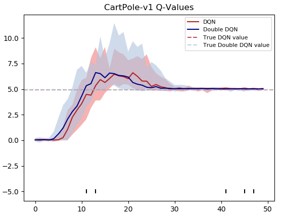
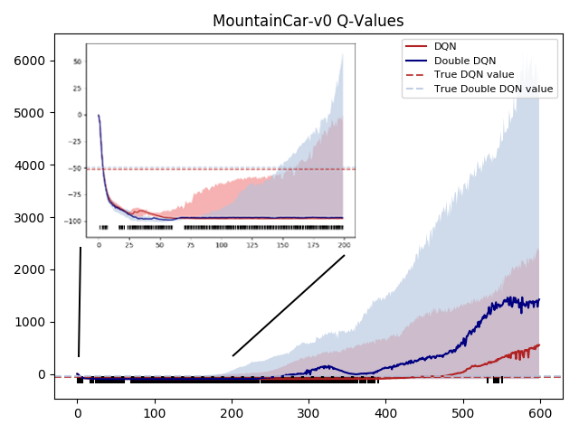
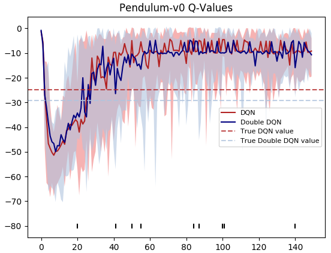
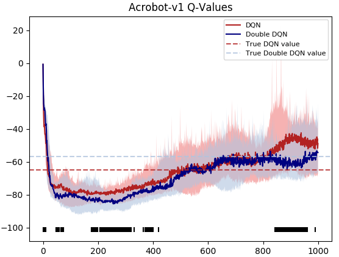

# Environment-related difference of Deep Q-Learning and Deep Double Q-Learning

## Introduction

The Q-learning algorithm is known to overestimate state-action values under certain conditions. 
A positive bias is introduced, as Q-learning uses the same function to select actions and evaluate a state-action pair. 
Hence, overoptimistic values are more likely to be used in updates. 
Hasselt (2016) showed that this can indeed be harmful for performance using Deep Neural Networks and proposed the 
*Deep Double Q-Learning* algorithm. We apply both algorithms and compare their performance on different environments 
provided by Open AI Gym (Brockman et al., 2016). 

## Experiments

We used the environments CartPole-v1, Acrobot-v1, MountainCar-v0, Pendulum-v0 from Open AI Gym and performed 
joined grid search over the hyperparameters on random seeds for both models with 10 models each , the best configuration
was selected based on the highest overall rewards achieved. The hyperparameters can be found in ``hyperparameters.py``.
 
Afterwards, we trained 15 models on each environment and used a Whitney-Man-U test to test
whether the significance in Q-value estimates is statistically significant (p=0.05).

## Results

The figures below show the average of Q-Value estimates during training for DQN and DDQN on four different environments 
over 15 different models. Intervals are determined by averaging the two most extreme values during every time step. 
The true values are determined by applying Monte Carlo rollout where the whole episode is played out to compute the 
total rewards following the policy found after training terminated. These true returns are indicated by
the dashed lines. Markers (bottom of x-axis) indicate time steps with statistically significant differences between DQN 
and DDQN (p = 0.05).

  

 

We observe the following things:
* Both algorithms perform well on **CartPole-v1**; environment less challenging due to easy credit assignment (immediate, 
positive and constant rewards)
* **Pendulum-v0**: Both get similar Q-value estimates, but DQN performs better than DDQN. The reason for
these observations might be due to the complex reward function requiring careful actions
* We can confirm the findings of Hasselt et al. (2016) for **Acrobot-v1**:
DDQN performs better on this task while also having Q-estimates that are closer to the true values
* Although both algorithms learn to solve the environment **MountainCar-v0**
, we suspect that using Deep Neural Networks to parameterize the Q-function
leads to unstable and unrealistic Q-values (non-negative)

## References

Hado van Hasselt, Arthur Guez, and David Silver.
Deep reinforcement learning with double q-learning.
In
Proceedings of the Thirtieth AAAI Conference on Artificial
Intelligence
, AAAI’16, pages 2094–2100. AAAI Press, 2016.

Greg Brockman, Vicki Cheung, Ludwig Pettersson, Jonas
Schneider, John Schulman, Jie Tang, and Wojciech Zaremba.
Openai gym.
arXiv preprint arXiv:1606.01540
, 2016.

Volodymyr Mnih, Koray Kavukcuoglu, David Silver, Andrei A
Rusu, Joel Veness, Marc G Bellemare, Alex Graves, Martin
Riedmiller, Andreas K Fidjeland, Georg Ostrovski, et al.

