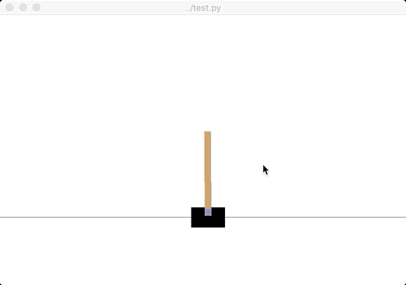
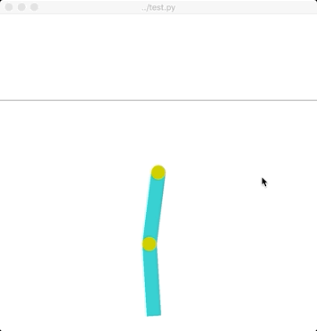
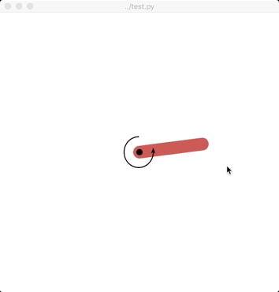

# Environment-related difference of Deep Q-Learning and Double Deep Q-Learning

This project was conducted for the Reinforcement Learning course of the Master Artificial Intelligence at the University 
of Amsterdam during the Winter term 2018/2019.

 

Samples of the performance of Double Deep Q Networks on different environments. While it
is able to solve most of the tasks at hand, it performed visibly worse for Pendulum, where the goal
is to balance it on top.

## Introduction

The Q-learning algorithm is known to overestimate state-action values under certain conditions. 
A positive bias is introduced, as Q-learning uses the same function to select actions and evaluate a state-action pair. 
Hence, overoptimistic values are more likely to be used in updates. 
Hasselt (2016) showed that this can indeed be harmful for performance using Deep Neural Networks and proposed the 
*Double Deep Q Networks* algorithm. We apply both algorithms and compare their performance on different environments 
provided by Open AI Gym (Brockman et al., 2016). 

## Experiments

We used the environments CartPole-v1, Acrobot-v1, MountainCar-v0, Pendulum-v0 from Open AI Gym and performed 
joined grid search over the hyperparameters on random seeds for both models with 10 models each , the best configuration
was selected based on the highest overall rewards achieved. The hyperparameters can be found in ``hyperparameters.py``.
 
Afterwards, we trained 15 models on each environment and used a two-tailed Mann-Whitney U (Nachar et al., 2008) test to test
whether the significance in Q-value estimates is statistically significant (p=0.05). The test was chosen because after
performing Shapiro-Wilk test for normality, most of the distributions could not be shown to be gaussian (p=0.05). 

## Results

The figures below show the average of Q-Value estimates during training for DQN and DDQN on four different environments 
over 15 different models. Intervals are determined by averaging the two most extreme values during every time step. 
The true values are determined by applying Monte Carlo rollout where the whole episode is played out to compute the 
total rewards following the policy found after training terminated. These true returns are indicated by
the dashed lines. Markers (bottom of x-axis) indicate time steps with statistically significant differences between DQN 
and DDQN (p = 0.05).

  

 

We observe the following things:
* Both algorithms perform well on **CartPole-v1**; environment less challenging due to easy credit assignment (immediate, 
positive and constant rewards)
* **Pendulum-v0**: Both get similar Q-value estimates, but DQN performs better than DDQN. The reason for
these observations might be due to the complex reward function requiring careful actions
* We can confirm the findings of Hasselt et al. (2016) for **Acrobot-v1**:
DDQN performs better on this task while also having Q-estimates that are closer to the true values
* Although both algorithms learn to solve the environment **MountainCar-v0**
, we suspect that using Deep Neural Networks to parameterize the Q-function
leads to unstable and unrealistic Q-values (non-negative), likely influenced by "deadly triad" (Hasselt et al., 2018).

## Conclusion 

* Only Acrobot-v1 shows significant performance
improvement when using DDQN
* Whether DDQN improves performance depends on
the reward structure of the environment, in our
environments the reward distributions are very
narrow, so there is not much room for maximization
bias to occur
* Due to parameterization with Deep Neural
Networks, Q-values can be unstable while still
achieving the objective (the "deathly triad" of Reinforcement Learning: Bootstrapping, off-policy learning 
and function approximation)
* Unrealistic q-value estimates don't necessarily translate into bad performance (e.g. most MountainCar models
were still able to solve the environment although using wildly unrealistic estimates)
* Function approximation (Neural Network), bootstrapping and off-policy learning (“deadly triad”) can lead to unstable Q-values while still achieving the objective

## Usage

To run the experiments yourself, first install all the necessary requirements

    cd quirky-quokka
    pip3 install -r requirements.txt
    
Then run the training script:

    python3 train.py
    
Models will be saved to the `models/` folder, plots and the data they are based on into `img/` and `data/` respectively.
Lastly, trained models can also be tested by rendering their environments using

    cd models
    python3 ../test.py <model_name>.pt
    
where the environment name has to be included in `<model_name>`, e.g.

    python3 ../test.py Acrobot-v1_ddqn0.pt
    
   

## References

Hado V Hasselt. Double q-learning. In Advances in Neural Information Processing Systems, pages 2613–2621, 2010.

Greg Brockman, Vicki Cheung, Ludwig Pettersson, Jonas Schneider, John Schulman, Jie Tang, and Wojciech Zaremba. Openai gym. arXiv preprint arXiv:1606.01540, 2016.

Nadim Nachar et al. The mann-whitney u: A test for assessing whether two independent samples come from the same distribution. Tutorials in Quantitative Methods for Psychology, 4(1):13–20, 2008.

Hado van Hasselt, Arthur Guez, and David Silver. Deep reinforcement learning with double q-learning. In Proceedings of the Thirtieth AAAI Conference on Artificial Intelligence, AAAI’16, pages 2094–2100. AAAI Press, 2016.

Hado van Hasselt, Yotam Doron, Florian Strub, Matteo Hessel, Nicolas Sonnerat, and Joseph Modayil. Deep reinforcement learning and the deadly triad. arXiv preprint arXiv:1812.02648, 2018.

Volodymyr Mnih, Koray Kavukcuoglu, David Silver, Andrei A Rusu, Joel Veness, Marc G Bellemare, Alex Graves, Martin Riedmiller, Andreas K Fidjeland, Georg Ostrovski, et al. Human-level control through deep reinforcement learning. Nature 518(7540):529, 2015.

